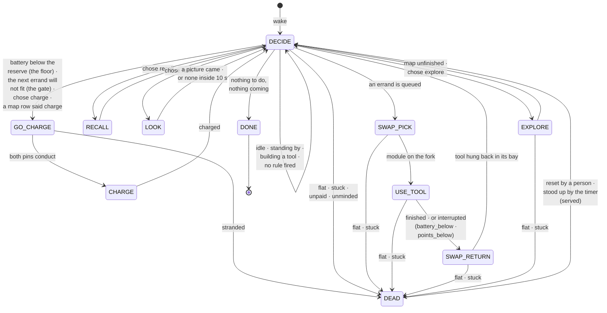
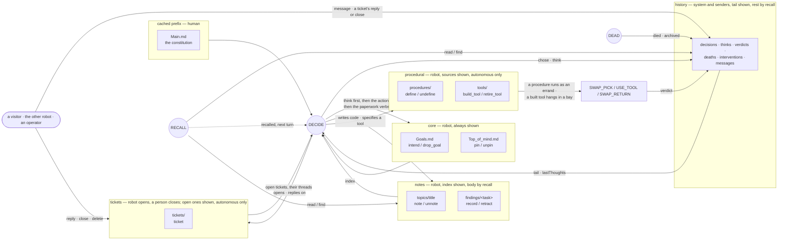

# pluggybot

A simulated, hardware-honest robot and the autonomous agent that lives in it.
What the project is for, and the six qualities the agent is meant to
maximise, are in [`docs/PluggyPlan.md`](docs/PluggyPlan.md); how the mind
sits in the loop is [`docs/Overseer.md`](docs/Overseer.md).

## The robot's day, as states

`HubLifecycle.run()` is one priority loop (Overseer.md §1): each pass asks the
questions below in order, and the first that answers moves the robot. The
state names are the code's (`lifecycle.State`); `tests/test_readme.py` reads
this diagram and fails when they, the death causes, the event types or the
memory verbs drift from it.



`DECIDE` is where the mind is consulted — or, on `autonomous`, where the
agent's own event map says whether to consult it (`EVENT_TYPES`:
`nothing_to_do`, `task_complete`, `task_failed`, `decision_failed`,
`battery_below`, `battery_above`, `points_below`, `message_received`,
`every`, `ticket_replied`, `stood_up`). The floor and the gate are `guarded`'s rails and come off on
`autonomous`; the interrupt out of `USE_TOOL` is a row of the agent's map,
and abort means stow. An errand is queued by a standing order, a decision, a
task the robot claimed or a procedure it wrote. `RECALL` reads a key or finds
by text, standing still; what it found rides the next turn, at most three
recalls in a row. `LOOK` (issue #275) asks the website for a picture from
the head camera's pose and stands still until it comes; the picture rides
the next turn as an image, at most two looks in a row. A death
(`DEATH_CAUSES`) can land in any moving state, and the stand-up that follows
ends whatever it lands in (issue #348): the loop starts again from the top.
On `autonomous` the agent also writes code and builds tools: a procedure it
defined (issue #166) is an action, `procedure:<name>`, and runs as an errand;
a tool it specified (issue #168) is built where it stands and hung in a bay.

### What each state reads and writes (the memory, issue #221)

Memory is four tiers over one record store (Overseer.md §7). The prefix is
cached and byte-identical for a run; everything a writer can touch rides the
user turn.



Retiring is the only forgetting: `unpin`, `unnote`, `retract` and `drop_goal`
mark a record retired and `recall` can still find it. A true death archives
everything the robot and the system wrote; the constitution survives, and so
does the ticket desk (issue #284): a ticket is a report about the world, and
the next robot inherits the world. The robot cannot close a ticket; a person
closes it (paid, once) or deletes it (not).

## Scripts

Start one of the various scripts:
```bash
uv run python scripts/teleop.py      # Teleop test the robot
uv run python scripts/map_teleop.py  # Teleop the robot while updating /map.png
uv run python scripts/explore.py     # Run the frontier exploration script (also updates map)

uv run python scripts/lifecycle.py    # THE loop the project is named after:
                                      # explore -> find an outlet -> dock ->
                                      # charge -> resume. Saves map.png/views.png

uv run python scripts/hub_mission.py --view  # Explore, find + use hub
uv run python scripts/hub_lifecycle.py --view  # Hub-era battery loop: explore,
                                      # fetch a tool, use it, stow it, charge

uv run python scripts/draw.py --view --fast
uv run python scripts/draw.py --program square   # square circle text house
                                      # tree sun robot -- the stroke programs
uv run python scripts/draw.py --program text --text "GOOD MORNING"
uv run python scripts/draw.py --program house --size 0.06   # figure box, m
uv run python scripts/draw.py --program text --size 0.025   # cap height, m

MUJOCO_GL=egl uv run python scripts/home_draw.py --program robot  # same flags,
                                      # but the full errand in the home world:
                                      # fetch the pen -> draw on a wall
                                      # whiteboard -> stow it
MUJOCO_GL=egl uv run python scripts/home_draw.py --program text \
    --text "HELLO" --board whiteboard_b --cycles 2

uv run python scripts/pickup.py --view   # claw module: pick a block off the
                                      # floor; saves pickup.png

MUJOCO_GL=egl uv run python scripts/module_power.py  # Tool power across the
                                      # coupling; saves module_power.png
```

Headless (no window) runs want `MUJOCO_GL=egl` in front; `--view` runs want it
left off.

## Recording a demo

`draw.py` and `pickup.py` take `--record PATH` (`.mp4` or `.gif`) and render
720p video straight from the sim — no screen capture. The camera is the
filmstrip's tracking camera, sampled on the **sim** clock, so playback speed
is exact and `--record-speed` buys timelapse or slow motion for free:

```bash
MUJOCO_GL=egl uv run python scripts/draw.py --program square \
    --record draw.mp4 --record-speed 3        # 66 s of sim -> 22 s of video
MUJOCO_GL=egl uv run python scripts/pickup.py \
    --record pickup.gif --record-speed 4 --record-fps 20
```

`--record` works with or without `--view` (the video comes from its own
offscreen renderer either way) and never changes what the demo reports.
`pickup.py` carries `claw_eye` as a picture-in-picture: the camera on the
tool itself, which no screen recording could reach. GIFs are downscaled to
640 px and encoded through a single shared palette; for Reddit prefer `.mp4`,
since it transcodes uploaded GIFs to video anyway.

View the world:
```bash
uv run python -m mujoco.viewer --mjcf=models/world.xml
```

Run scripts in /tests/ :
```bash
uv run pytest -v
# or, to output print statements:
uv run pytest -vs
```

# Running Pluggyworld on rooftop-media.org

In this project, start it like so:
```bash
PLUGGYWORLD_TOKEN=dev-token-change-me MUJOCO_GL=osmesa \
  uv run python scripts/serve.py --world home \
    --endpoint ws://localhost:3000/api/pluggyworld/ingest
```

Then, in `rooftop-media-2026`, start it with `npm run dev`

`--world home` serves the generated house + garden (issue #6) — the world
the site is meant to show. Drop the flag to serve `room_hub` instead, the
bare rack room the hub mechanics were built in. The flag picks *everything*
the world implies (model, scene name, rack pose, grid extent, battery size,
start pose, errand destination, explore budget) from one table,
`hub.lifecycle.world_config()`, because every one of those getting out of
step fails silently rather than loudly: the wrong explore budget just stops
filling the map, and the wrong errand destination just drives at a wall.

Whichever world you serve, the site must be showing the matching scene —
the header's `model` field is what it selects on (`home_world` vs
`room_hub`), and both scenes plus a recorded mission for each are committed
under `protocol/`.

## Letting the robot choose its own errands

Add `--overseer` and an API key, and an LLM (Claude Haiku 4.5) picks what the
robot does next once the `--errand` queue is empty:

```bash
PLUGGYWORLD_TOKEN=dev-token-change-me ANTHROPIC_API_KEY=... MUJOCO_GL=osmesa \
  uv run python scripts/serve.py --world home --errand none --overseer \
    --endpoint ws://localhost:3000/api/pluggyworld/ingest
```

It replaces **exactly one branch** of the mission loop — which errand, when
the battery is fine and nothing is queued. Charging stays in code and outranks
it, because an LLM that can decline to charge is one that bricks the world
overnight. Every failure (no key, timeout, rate limit, a malformed answer, a
spent call budget) falls back to a scripted rotation and says so on the wire,
so the robot keeps working with the API unplugged — that is a tested property,
not a hope. Its memory is a record store and the documents rendered from it,
under `/var/lib/pluggybot/thoughts` (the diagram above; `docs/Overseer.md`
§7): `Main.md` is yours to choose — a file from the library in
`src/pluggybot/mind/constitutions/`, named by `$PLUGGY_CONSTITUTION` (#263) —
the rest is the robot's and the sim's.

Full design, the action vocabulary, the cost numbers and the measured battery
limit: `docs/Overseer.md`. To see what a decision actually costs before
wiring it into a long run:

```bash
# both need a key; --tokens-only makes no decisions and bills no tokens
ANTHROPIC_API_KEY=... uv run python scripts/overseer_probe.py --tokens-only
ANTHROPIC_API_KEY=... uv run python scripts/overseer_probe.py --calls 4
```

# Outlet visual recognition with Yolo CNN

Regenerate the training data:
```bash
MUJOCO_GL=egl uv run python scripts/generate_outlet_dataset.py --count 1200
```

Train the outlet detector with YOLO:
```bash
uv run yolo detect train data=datasets/outlets/dataset.yaml model=yolo11n.pt epochs=50 imgsz=640
```

Test predictions with YOLO:
```bash
uv run yolo predict model=runs/detect/train/weights/best.pt source=datasets/outlets/images/val
```
