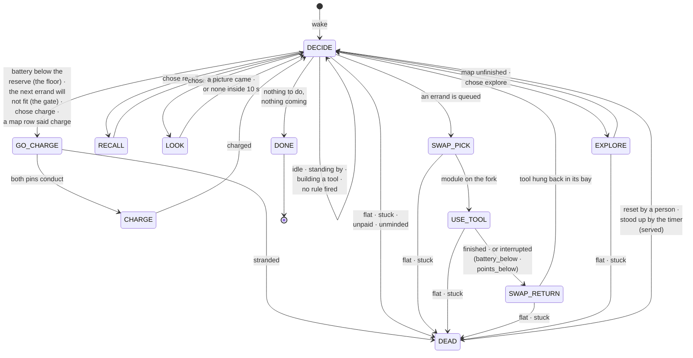
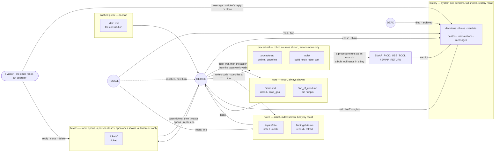

# pluggybot

A simulated, hardware-honest robot and the autonomous agent that lives in it:
a ~10 kg quadruped with a two-joint arm, in a house it shares with a second
one. What the project is for, and the six qualities the agent is meant to
maximise, are in [`docs/PluggyPlan.md`](docs/PluggyPlan.md); how the mind
sits in the loop is [`docs/Overseer.md`](docs/Overseer.md).

## The robot's day, as states

`HubLifecycle.run()` is one priority loop (Overseer.md §1): each pass asks the
questions below in order, and the first that answers moves the robot. The
state names are the code's (`lifecycle.State`); `tests/test_readme.py` reads
this diagram and fails when they, the death causes, the event types or the
memory verbs drift from it.


```mermaid
---
config:
  state:
    nodeSpacing: 90
    rankSpacing: 90
---
stateDiagram-v2
    direction TB
    [*] --> DECIDE : wake

    DECIDE --> GO_CHARGE : battery below the<br/>reserve (the floor) ·<br/>the next errand will<br/>not fit (the gate) ·<br/>chose charge ·<br/>a map row said charge
    GO_CHARGE --> CHARGE : both pins conduct
    CHARGE --> DECIDE : charged
    GO_CHARGE --> DEAD : stranded

    DECIDE --> RECALL : chose recall
    RECALL --> DECIDE

    DECIDE --> LOOK : chose look
    LOOK --> DECIDE : a picture came ·<br/>or none inside 10 s

    DECIDE --> SWAP_PICK : an errand is queued
    SWAP_PICK --> USE_TOOL : module on the fork
    USE_TOOL --> SWAP_RETURN : finished · or interrupted<br/>(battery_below ·<br/>points_below)
    SWAP_RETURN --> DECIDE : tool hung back in its bay

    DECIDE --> EXPLORE : map unfinished ·<br/>chose explore
    EXPLORE --> DECIDE

    DECIDE --> DONE : nothing to do,<br/>nothing coming
    DONE --> [*]

    DECIDE --> DECIDE : idle · standing by ·<br/>building a tool ·<br/>no rule fired

    DECIDE --> DEAD : flat · stuck ·<br/>unpaid · unminded
    SWAP_PICK --> DEAD : flat · stuck
    USE_TOOL --> DEAD : flat · stuck
    SWAP_RETURN --> DEAD : flat · stuck
    EXPLORE --> DEAD : flat · stuck
    DEAD --> DECIDE : reset by a person ·<br/>stood up by the timer<br/>(served)
```

`DECIDE` is where the mind is consulted — or, where it keeps an event map,
where the agent's own map says whether to consult it (`EVENT_TYPES`:
`nothing_to_do`, `task_complete`, `task_failed`, `decision_failed`,
`battery_below`, `battery_above`, `points_below`, `message_received`,
`every`, `ticket_replied`, `stood_up`). The floor and the gate are the
rails of the loop with no mind, and are off wherever there is one; the
interrupt out of `USE_TOOL` is a row of the agent's map, and abort means
stow. An errand is queued by a standing order, a decision, a
task the robot claimed or a procedure it wrote. `RECALL` reads a key or finds
by text, standing still; what it found rides the next turn, at most three
recalls in a row. `LOOK` (issue #275) asks the website for a picture from
the head camera's pose and stands still until it comes; the picture rides
the next turn as an image, at most two looks in a row. A death
(`DEATH_CAUSES`) can land in any moving state, and the stand-up that follows
ends whatever it lands in (issue #348): the loop starts again from the top.
On `autonomous` the agent also writes code and builds tools: a procedure it
defined (issue #166) is an action, `procedure:<name>`, and runs as an errand;
a tool it specified (issue #168) is built where it stands and hung in a bay
of the built-tool rail beside its rack's (#407).

### What each state reads and writes (the memory, issue #221)

Memory is four tiers over one record store (Overseer.md §7). The prefix is
cached and byte-identical for a run; everything a writer can touch rides the
user turn.


```mermaid
flowchart LR
    subgraph prefix [cached prefix — human]
        MAIN["Main.md<br/>the constitution"]
    end
    subgraph core [core — robot, always shown]
        GOALS["Goals.md<br/>intend / drop_goal"]
        TOP["Top_of_mind.md<br/>pin / unpin"]
    end
    subgraph notes [notes — robot, index shown, body by recall]
        NOTES["topics/title<br/>note / unnote"]
        FIND["findings/&lt;task&gt;<br/>record / retract"]
    end
    subgraph history [history — system and senders, tail shown, rest by recall]
        HIST["decisions · thinks · verdicts ·<br/>deaths · interventions · messages"]
    end
    subgraph procedural [procedural — robot, sources shown, autonomous only]
        PROCS["procedures/<br/>define / undefine"]
        TOOLS["tools/<br/>build_tool / retire_tool"]
    end
    subgraph desk [tickets — robot opens, a person closes; open ones shown, autonomous only]
        TICKETS["tickets/<br/>ticket"]
    end

    DECIDE((DECIDE)) -->|think first, then the action,<br/>then the paperwork verbs| core
    DECIDE --> notes
    DECIDE -->|writes code · specifies a tool| procedural
    DECIDE -->|chose · think| HIST
    RECALL((RECALL)) -->|read / find| notes
    RECALL -->|read / find| HIST
    RECALL -.->|recalled, next turn| DECIDE
    USE["SWAP_PICK / USE_TOOL / SWAP_RETURN"] -->|verdict| HIST
    procedural -->|a procedure runs as an errand ·<br/>a built tool hangs in a bay| USE
    DECIDE -->|opens · replies on| desk
    VISITOR([a visitor · the other robot · an operator]) -->|message · a ticket's reply or close| HIST
    VISITOR -->|reply · close · delete| desk
    desk -->|open tickets, their threads| DECIDE
    DEAD((DEAD)) -->|died · archived| HIST
    prefix --> DECIDE
    core --> DECIDE
    notes -->|index| DECIDE
    HIST -->|tail · lastThoughts| DECIDE
```

Retiring is the only forgetting: `unpin`, `unnote`, `retract` and `drop_goal`
mark a record retired and `recall` can still find it. A true death archives
everything the robot and the system wrote; the constitution survives, and so
does the ticket desk (issue #284): a ticket is a report about the world, and
the next robot inherits the world. The robot cannot close a ticket; a person
closes it (paid, once) or deletes it (not).

## Scripts

Every script takes `--help`, and CLAUDE.md's table says what each is for.
Headless (no window) runs want `MUJOCO_GL=egl` in front; `--view` runs want
it left off.

The quadruped (#375) and its arm (#378), each scene looping until the window
closes:
```bash
uv run python scripts/arm_spike.py --view         # fetch a tool: find the rack,
                                      # walk in by its tags, pick, hold it up,
                                      # hang it back
uv run python scripts/arm_spike.py --view carry   # walk, trot, stop, turn and
                                      # sidestep with a tool on the fork
uv run python scripts/arm_spike.py --view stairs  # over a hill of the house's
                                      # flight and back, carrying one
uv run python scripts/arm_spike.py --view fall    # pushed over: the arm folds
                                      # and it stands (every other time not)
uv run python scripts/arm_spike.py --view reach   # the arm through the targets
                                      # that chose it, a marker at each
uv run python scripts/dock_spike.py --view        # lying down onto the dock
uv run python scripts/quad_spike.py --policy --view  # the walking policy
uv run python scripts/two_robots.py --world home_quad --view --errands none,none
                                      # the served pair in the home world
```

`arm_spike.py --help` lists the tables behind the scenes (`--capture`,
`--approach`, `--retention --stairs`, ...); SimNotes, "The quadruped's arm,
its coupling and the rack", has what they measured.

View the body alone:
```bash
uv run python -m mujoco.viewer --mjcf=models/quadruped.xml
```
(`models/home_world.xml` is the house with no robot in it; the quadruped
and its dock are put in at load, `legs/world.py`.)

Run scripts in /tests/ :
```bash
uv run pytest -v
# or, to output print statements:
uv run pytest -vs
```

# Running Pluggyworld on rooftop-media.org

In this project, start it like so:
```bash
PLUGGYWORLD_TOKEN=dev-token-change-me MUJOCO_GL=osmesa \
  uv run python scripts/serve.py \
    --endpoint ws://localhost:3000/api/pluggyworld/ingest
```

Then, in `rooftop-media-2026`, start it with `npm run dev`

It serves the generated house + garden (issue #6) with the quadruped in it
(`home_quad`, issue #387), the one world; `--pair` serves both robots, as
the deployed world does. Everything the world implies (model, scene name,
dock and rack poses, grid extent, battery size, start pose, explore budget)
comes from one table, `lifecycle.world_config()`, because every one of those
getting out of step fails silently rather than loudly: the wrong explore
budget just stops filling the map.

The site must be showing the matching scene — the header's `model` field is
what it selects on (`home_quad` or `home_quad_pair`), and both scenes, and a
recorded day of the pair, are committed under `protocol/`.

## Letting the robot choose its own errands

Add `--overseer` and an API key, and an LLM (Claude Haiku 4.5) picks what the
robot does next once the `--errand` queue is empty:

```bash
PLUGGYWORLD_TOKEN=dev-token-change-me ANTHROPIC_API_KEY=... MUJOCO_GL=osmesa \
  uv run python scripts/serve.py --overseer \
    --endpoint ws://localhost:3000/api/pluggyworld/ingest
```

That is the one mind (`--arm autonomous` on its defaults): the rails are
off, so when to charge, what it can afford and which job to take are the
robot's, and the prompt says so. Every failure (no key, timeout, rate limit,
a malformed answer, a spent call budget) falls back to the agent's own
standing order — `idle` until it leaves one — and says so on the wire. The
deployed world flies `--pair --arm autonomous --origin unseeded`: the agent
also decides when it is asked (Evaluation.md §2). Its memory is a record
store and the documents rendered from it, under `/var/lib/pluggybot/thoughts`
(the diagram above; `docs/Overseer.md` §7): `Main.md` is yours to choose —
a file from the library in `src/pluggybot/mind/constitutions/`, named by
`$PLUGGY_CONSTITUTION` (#263) — the rest is the robot's and the sim's.

Full design, the action vocabulary, the cost numbers and the measured battery
limit: `docs/Overseer.md`. To see what a decision actually costs before
wiring it into a long run:

```bash
# both need a key; --tokens-only makes no decisions and bills no tokens
ANTHROPIC_API_KEY=... uv run python scripts/overseer_probe.py --tokens-only
ANTHROPIC_API_KEY=... uv run python scripts/overseer_probe.py --calls 4
```
